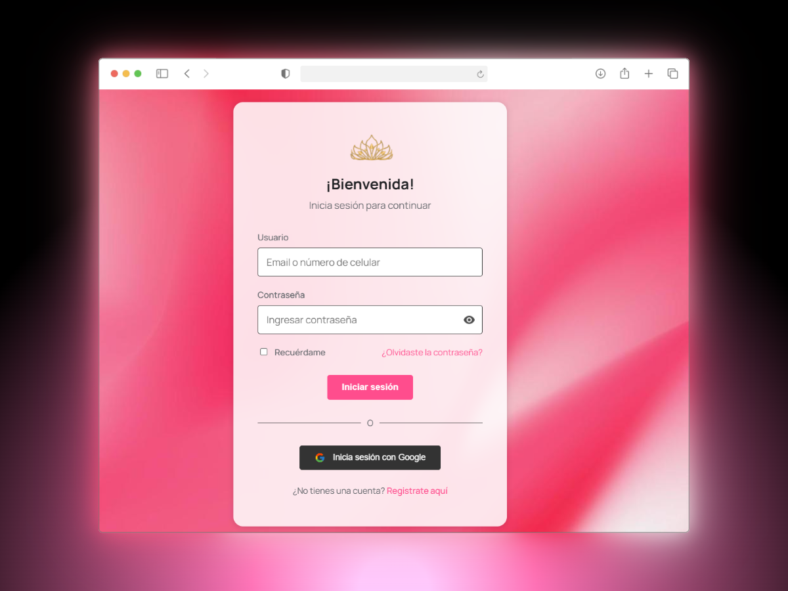

# 💻 Ponte Guapa - TPS. 



## ✨ Introducción

Este proyecto es el desarrollo de un sistema de información transaccional hecho con Laravel que permite la gestión y administración de servicios de la empresa **Ponte Guapa**. La plataforma ofrece una interfaz elegante para que los usuarios puedan registrarse, iniciar sesión, gestionar su perfil, agendar citas y explorar servicios. Para los administradores, existe un panel de control desde donde se puede gestionar usuarios, productos, citas y estadísticas.

## 🏗️ Estructura del Proyecto (MVC)

Este proyecto sigue el patrón arquitectónico Modelo-Vista-Controlador (MVC) característico de Laravel, organizando el código de manera intuitiva y mantenible:

### 📊 Modelos (Models)

Los modelos representan las entidades del sistema y la lógica de negocio:

- `User.php`: Define la estructura de usuarios con propiedades como nombre, email y contraseña.

### 🖼️ Vistas (Views)

Las vistas son las interfaces con las que interactúan los usuarios:

- **Auth**: Contiene las vistas para procesos de autenticación:
  - `login.blade.php`: Formulario de inicio de sesión
  - `register.blade.php`: Formulario de registro
  - `reset-password.blade.php`: Vista para restablecer contraseña
  - `forgot-password.blade.php`: Vista para solicitar recuperación de contraseña

- **Dashboard**: 
  - `dashboard.blade.php`: Panel principal para usuarios autenticados

- **Profile**:
  - Vistas para editar información del perfil de usuario

### 🎮 Controladores (Controllers)

Los controladores manejan las solicitudes HTTP y la lógica de la aplicación:

- **Auth Controllers**:
  - `AuthenticatedSessionController.php`: Gestiona el inicio y cierre de sesión
  - `RegisteredUserController.php`: Maneja el registro de nuevos usuarios
  - `PasswordResetLinkController.php`: Administra las solicitudes de restablecimiento
  - `NewPasswordController.php`: Controla el proceso de nueva contraseña
  - `PasswordController.php`: Gestiona actualizaciones de contraseña
  - `EmailVerificationNotificationController.php`: Maneja notificaciones de verificación
  
- **Profile Controller**:
  - `ProfileController.php`: Gestiona la edición y eliminación de perfil

### 🛣️ Rutas (Routes)

- `web.php`: Define las rutas principales de la aplicación
- `auth.php`: Contiene las rutas específicas para la autenticación

## 📂 Estructura de Directorios

```
ponte-guapa/
│
├── app/                            # Núcleo de la aplicación
│   ├── Http/
│   │   ├── Controllers/            # Controladores de la aplicación
│   │   │   ├── Auth/               # Controladores de autenticación
│   │   │   │   ├── AuthenticatedSessionController.php
│   │   │   │   ├── ConfirmablePasswordController.php
│   │   │   │   ├── EmailVerificationNotificationController.php
│   │   │   │   ├── EmailVerificationPromptController.php
│   │   │   │   ├── NewPasswordController.php
│   │   │   │   ├── PasswordController.php
│   │   │   │   ├── PasswordResetLinkController.php
│   │   │   │   ├── RegisteredUserController.php
│   │   │   │   └── VerifyEmailController.php
│   │   │   ├── Controller.php
│   │   │   └── ProfileController.php
│   │   └── Requests/               # Validación de formularios
│   │       └── Auth/
│   │           └── LoginRequest.php
│   │
│   ├── Models/                     # Modelos de la aplicación
│   │   └── User.php
│   │
│   └── Providers/                  # Proveedores de servicios
│
├── bootstrap/                      # Archivos de inicialización
│
├── config/                         # Configuración de la aplicación
│
├── database/                       # Migraciones y semillas
│   ├── factories/
│   ├── migrations/
│   └── seeders/
│
├── public/                         # Archivos accesibles públicamente
│   ├── styles/                     # Hojas de estilo CSS compiladas
│   │   ├── login.css
│   │   ├── register.css
│   │   └── dashboard.css
│   │
│   └── resources/                  # Recursos estáticos
│       ├── icons/
│       │   ├── icon.png
│       │   ├── icon-eye.png
│       │   └── icon-google.svg
│       └── images/
│           └── background.jpeg
│
├── resources/                      # Recursos de la aplicación
│   ├── css/                        # Archivos de estilo (Tailwind)
│   │   └── app.css
│   ├── js/                         # Scripts JavaScript
│   │   ├── app.js
│   │   └── bootstrap.js
│   └── views/                      # Vistas Blade
│       ├── auth/
│       │   ├── confirm-password.blade.php
│       │   ├── forgot-password.blade.php
│       │   ├── login.blade.php
│       │   ├── register.blade.php
│       │   ├── reset-password.blade.php
│       │   └── verify-email.blade.php
│       ├── dashboard.blade.php
│       └── profile/
│           └── edit.blade.php
│
├── routes/                         # Definición de rutas
│   ├── auth.php                    # Rutas de autenticación
│   ├── web.php                     # Rutas web principales
│   ├── api.php                     # Rutas API
│   └── console.php                 # Rutas para comandos
│
├── storage/                        # Almacenamiento (logs, cache, etc.)
│
├── tests/                          # Pruebas automatizadas
│
├── vendor/                         # Dependencias de Composer
│
├── .env.example                    # Ejemplo de configuración de entorno
├── artisan                         # CLI de Laravel
├── composer.json                   # Dependencias de PHP
├── package.json                    # Dependencias de JavaScript
└── README.md                       # Este archivo
```

## 🚀 Instalación y Configuración Local

Sigue estos pasos para configurar y ejecutar el proyecto en tu entorno local:

### Requisitos Previos

- [XAMPP](https://www.apachefriends.org/index.html) (con PHP 8.1+ y MySQL)
- [Composer](https://getcomposer.org/download/)
- [Node.js](https://nodejs.org/en/) y NPM

### Pasos de Instalación

1. **Clonar el repositorio**

```bash
git clone https://github.com/tu-usuario/ponte-guapa.git
cd ponte-guapa
```

2. **Instalar dependencias de PHP**

```bash
composer install
```

3. **Instalar dependencias de JavaScript**

```bash
npm install
npm run dev
```

4. **Configurar la base de datos**

- Inicia XAMPP y activa los servicios Apache y MySQL
- Accede a PhpMyAdmin: http://localhost/phpmyadmin
- Crea una nueva base de datos llamada `ponteguapa`
- Edita el archivo `.env` con los datos de tu conexión:

```
DB_CONNECTION=mysql
DB_HOST=127.0.0.1
DB_PORT=3306
DB_DATABASE=ponteguapa
DB_USERNAME=root
DB_PASSWORD=
```

5. **Ejecutar migraciones**

```bash
php artisan migrate
```

6. **Crear datos de prueba (ejecutar los seeders de datos)**

```bash
php artisan db:seed
```

7. **Iniciar el servidor**

```bash
php artisan serve
```

8. **Acceder a la aplicación**

Abre tu navegador y visita: http://localhost:8000

## 🔧 Funcionalidades Principales

- Sistema completo de autenticación de usuarios (registro, login, recuperación de contraseña)
- Panel de administración con información relevante
- Gestión de perfiles de usuario
- Sistema preparado para gestión de citas, productos y usuarios

## Tecnologías Utilizadas
- **Backend**: Laravel 12.10.2, PHP 8.2
- **Frontend**: Tailwind CSS, Alpine.js, Blade
- **Panel Admin**: Filament
- **Base de datos**: MySQL
- **Gestión de paquetes**: Composer, NPM
- **Testing**: Pest, PHPUnit

## Comandos útiles
- Ejecutar servidor de desarrollo: `php artisan serve`
- Optimizar la ejecución en el servidor de desarrollo: `php artisan optimize`
- Ejecutar migraciones: `php artisan migrate`

